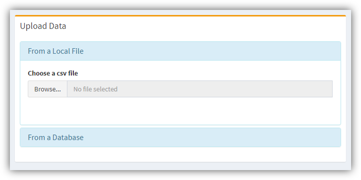
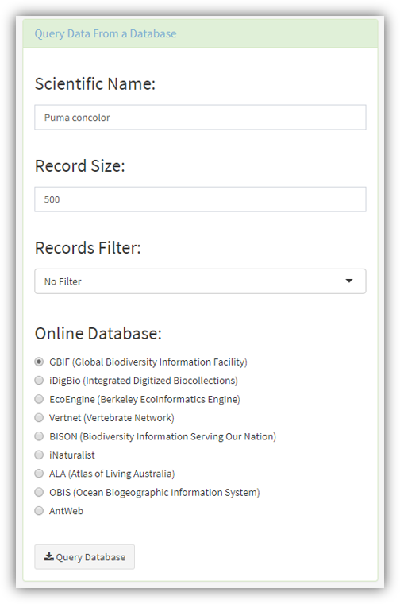
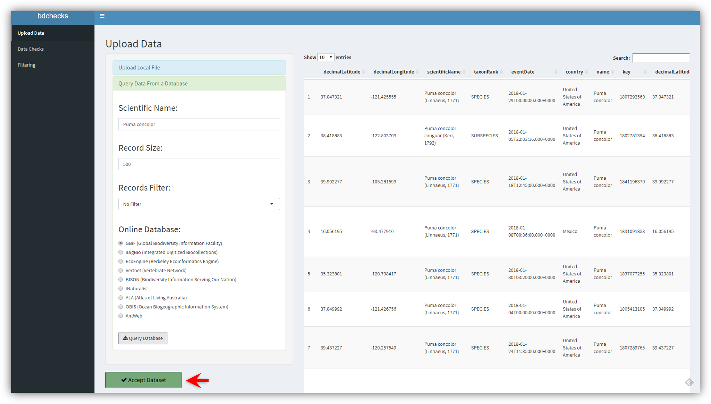
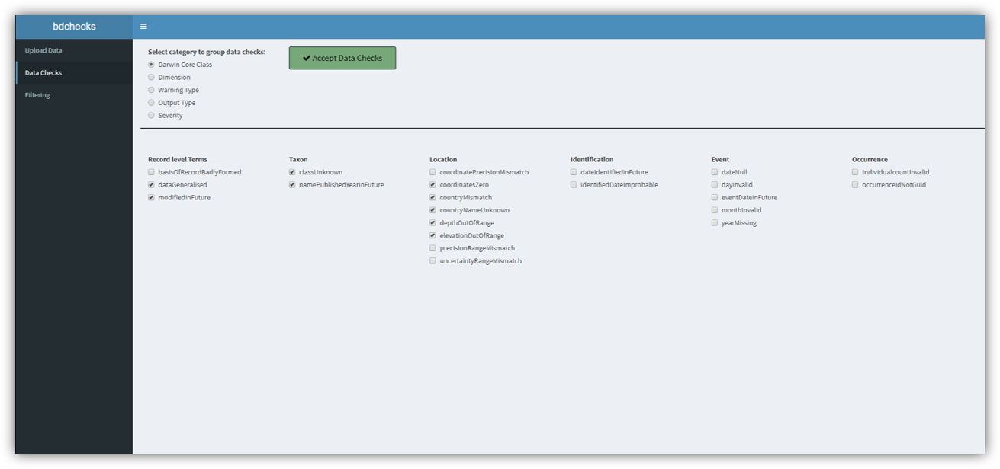
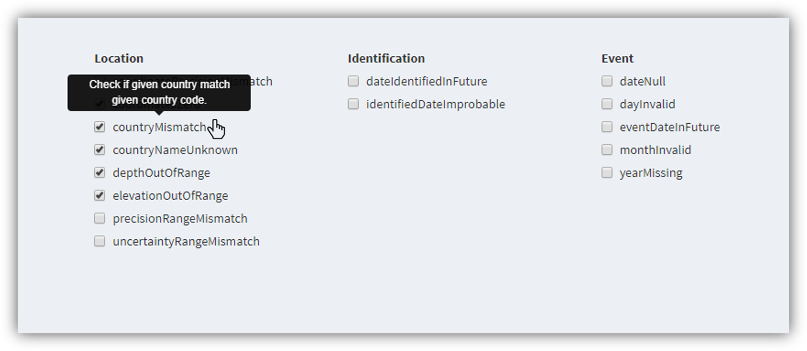
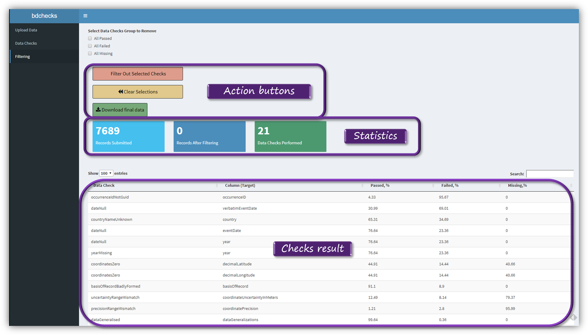
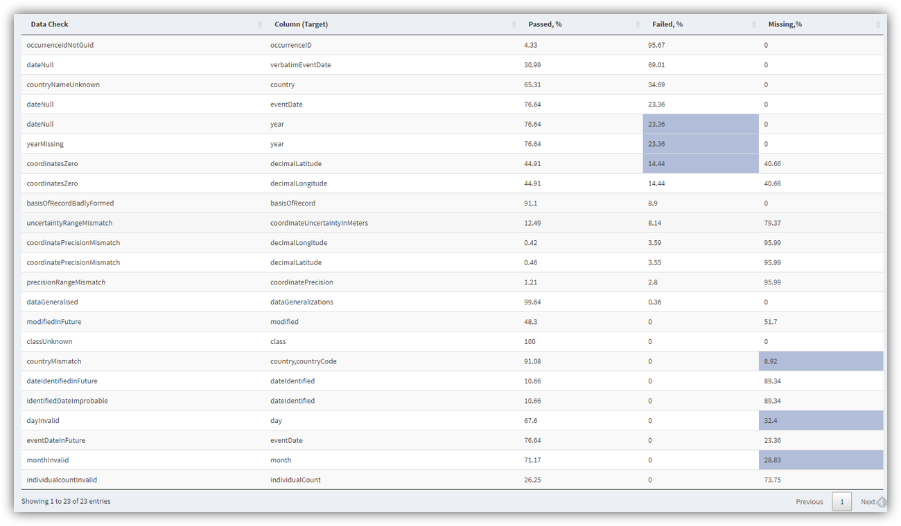
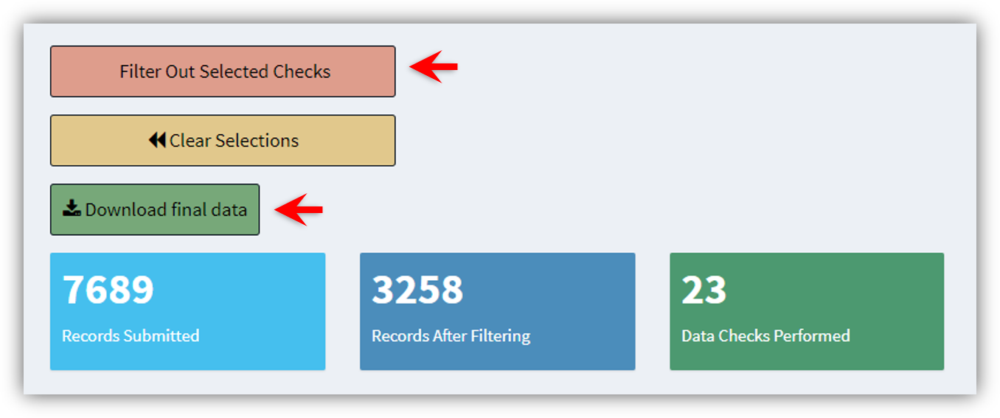

# The shiny app

***

## Launching the app

```r
library(bdchecks) # Uplaod package library
runbdchecks() # Launch the app
```


## Data upload

### From a local file

A CSV file or a Darwin Core Archive (DwC-A) zip file can be uploaded.


[comment]: <> (Need-To-Be-Updated!)


 

### From an online database

Also, data can be retrieved directly from various online biodiversity databases. You need only to:

* Select the database
* Specify the desired scientific name.
* Specify the number of records (upper limit of 50,000).
* Check the box if records must have coordinates.
* Wait for data to be downloaded.

[comment]: <> (Need-To-Be-Updated!)



### Accept dataset
[comment]: <> (Need-To-Be-Updated!)



## Choose data checks
[comment]: <> (Need-To-Be-Updated!)






## Checks results and data filtering

### Overwiew

[comment]: <> (Need-To-Be-Updated!)



### Filtering the data based on the results

[comment]: <> (Need-To-Be-Updated!)






## Closing the app
Just close the app browser tab, and the R session will be terminated. To reopen it run in the R Console `runbdchecks()`.

## References

