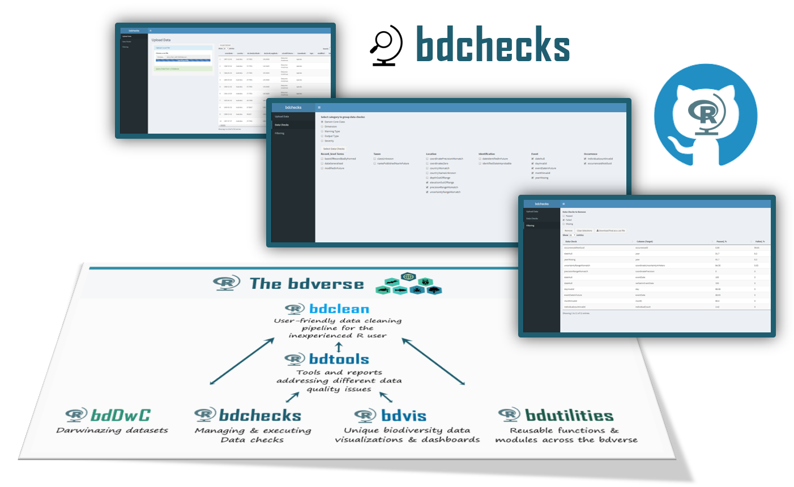

--- 
title: "`bdchecks` User Guide"
author: "Authors: Tomer Gueta and Povilas Gibas"
date: "`r paste0('built on ', Sys.Date())`"
site: bookdown::bookdown_site
documentclass: book
bibliography: [bib/book.bib, bib/DarwinCloud.bib, bib/DwC-paper.bib, bib/Veiga-2017.bib]
biblio-style: apalike
link-citations: yes
github-repo: bd-R/bdchecks-guide
url: 'http\://bd-r.github.io/bdchecks-guide/'
description: "Check your data: perform and manage various data checks for biodiversity data"
---

# Introduction {-}

`bdchecks` supplies a Shiny app and a set of functions to perform and manage various data checks for biodiversity data. `bdchecks` is part of the `bdverse`-- a collection of tools, that form a general framework for facilitating biodiversity science in R.

#### What are biodiversity data checks? {-}

Data checks can include format checks, completeness checks, reasonableness checks, limit checks, etc. These processes usually result in flagging, documenting, and subsequent correcting or eliminating of suspect records. The checks must be specifically tailored around the structure of the data at hand, in our case, the Darwin Core standard. Ideally, a data check needs to hold its functionality and relevant metadata.

#### What `bdchecks` can do for you? {-}

`bdchecks` offers various features for various R users:

* Using the Shiny app **inexperienced R users** can easily perform all data check and can easily filter the data accordingly. See [The shiny app] section.
* **Experienced R users** can perform all data checks by utilizing few R functions form the command line or within an R script. See [Command line operations] section.
* **Advanced R users** can even edit, add and manage their own collection of data checks, quite easily so. See [Data checks YAML file] section. 

#### Fundings {-}

  

* <a href="https://github.com/rstats-gsoc/gsoc2018/wiki/Darwinazing-biodiversity-data-in-R" target="_blank">See the GSoC project idea page</a>

